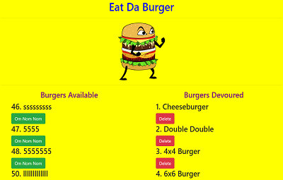

#
<h1>

Eat Da Burger

</h1>

### Eat Da Burger is a full stack website built with HTML, CSS, jQuery, Node.js, Express.js, Handlebars.js, and MySQL. Users are able to click a button to 'Devour' one of the burgers listed, or add their own to the database. 

---
[CLICK ME to see it in action](http://)
 
---

This project was created and is maintained by Daniel Olivas

To get help:  
me@danielolivas.net 
http://danielolivas.net